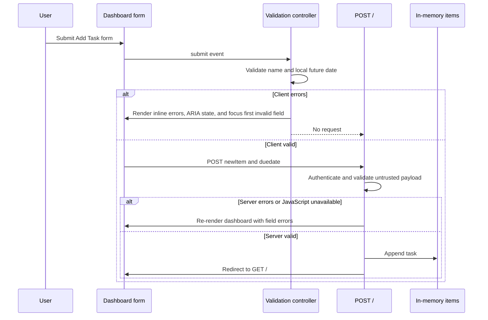

# Design Specification: EPMCDMETST-60216

## Meta

- **Ticket:** EPMCDMETST-60216
- **Title:** Registered user: Validate todo task form with inline, accessible error messages
- **Version:** 1.0
- **Status:** Ready for implementation, subject to the server-validation flag below
- **Author:** Architecture agent
- **Date:** 2026-08-20
- **Review iteration:** 0
- **Input:** [problem_spec.md](problem_spec.md)

## Scope and Outcome

Add progressive client-side validation to the authenticated dashboard's Add Task form. The enhancement must stop invalid browser submissions, show field-level accessible errors, focus the first invalid field, and allow valid submissions to continue through the existing `POST /` request contract. It must not alter task storage, authentication, deletion, route paths, field names, or valid-request semantics.

The design also requires the existing server handler to validate the same inputs before parsing and persisting them. Client-side validation improves feedback; server-side validation is the security and correctness boundary for direct requests and the no-JavaScript path.

## Current Architecture

| Area | Current responsibility | Relevant implementation |
| --- | --- | --- |
| Flask application | Authentication, dashboard rendering, task creation, in-memory task list | [main.py](../../../main.py) |
| Dashboard template | Renders task list and the Add Task form | [templates/index.html](../../../templates/index.html) |
| Stylesheet | Provides dashboard, input, and responsive presentation styles | [static/style.css](../../../static/style.css) |
| Add Task form contract | `POST /` with `newItem` and `duedate` | [templates/index.html](../../../templates/index.html) and [main.py](../../../main.py) |

The form currently uses `required` on both controls and a native `input[type="date"]`. The route directly indexes both submitted values, splits the date string, converts it to integers, and persists the task. Consequently, a direct malformed or missing request can raise an exception or be stored incorrectly rather than receive an authoritative validation response.

No JavaScript file, test suite, test configuration, lint configuration, or review feedback file exists in the repository at design time.

## Design Pattern

Use progressive enhancement with a form-scoped validation controller:

1. The server renders a complete, valid native HTML form, including labels, `required` attributes, a date control, and empty locations for field errors.
2. A small, dedicated client-side script attaches only after the document and target form are available. It sets `form.noValidate = true` only after attachment so its submit handler always controls custom error rendering. JavaScript absence therefore leaves browser-native constraint validation and the server submission path intact.
3. On submit, the controller evaluates both fields, updates each field's presentation and accessibility state from the resulting field-error model, and prevents the request only when at least one error exists.
4. The same server validation runs on every `POST /` before parsing, creating, or appending an item. Invalid server submissions re-render the dashboard with field errors and the submitted values preserved. Valid submissions retain the current redirect-to-dashboard behavior.

Keep this logic local to the dashboard rather than introducing a framework, API endpoint, custom date picker, or asynchronous validation.

## Component Design

### Dashboard Template

Update the Add Task form in [templates/index.html](../../../templates/index.html) with stable semantic hooks and field structure:

- Give the form a unique identifier used by the validation controller.
- Add an explicit label for task name and due date. Placeholders may remain supplemental but must not be the only accessible names.
- Preserve `name="newItem"`, `name="duedate"`, `method="POST"`, `action="/"`, and `required` on both controls.
- Keep the due-date control as `type="date"`.
- Add stable IDs to the two inputs and to their own initially empty inline error elements.
- Render each error element adjacent to its field, with an ARIA live mechanism such as `role="alert"` / assertive live behavior so changed messages are announced.
- When server validation produces a field error, render that message and the matching invalid state during the server response. Repopulate only safe submitted text/date values; HTML autoescaping remains enabled.
- Load the new dashboard validation script with `defer` so it does not block rendering and executes after markup parsing.

The client script must use the existing error elements rather than dynamically creating and removing different structures. Persistent regions reduce accessibility inconsistency and make the control-to-error relationship deterministic.

### Client Validation Controller

Add a single static JavaScript asset, `static/task-form-validation.js`, owned only by the Add Task form. It should expose no global API, set `form.noValidate = true` after locating the identified form, and attach one submit handler to it. This preserves `required` attributes and native behavior without JavaScript, while ensuring the script receives every JavaScript-enabled submit attempt.

The controller maintains a two-entry, transient field-error model keyed by the request names `newItem` and `duedate`. Each field evaluation produces either no error or one message selected from the controlled error vocabulary below.

| Field | Validation order | Valid condition | Error message |
| --- | --- | --- | --- |
| `newItem` | First | `trim()` is non-empty | `Enter a task name.` |
| `duedate` | Second | Value exists, native validity is valid, string represents a real calendar date, and it is strictly after local today | `Enter a due date.`; `Enter a valid calendar date.`; or `Choose a due date later than today.` |

Due-date evaluation must distinguish empty input first. For a non-empty value, consult native date validity, then parse only the expected ISO calendar-date representation into numeric year/month/day parts and verify that reconstruction yields the same parts. This prevents date-rollover acceptance. Compare numeric calendar parts against a local-today value constructed from the browser's local year, month, and day; do not compare UTC timestamps or locale-formatted strings.

Native date controls can prevent unparseable input from reaching script in some browsers. When a value is available but `validity.valid` is false, use the valid-calendar-date message. This maintains useful feedback without replacing browser-native control behavior.

On each submit:

1. Validate both controls in form order, even after discovering the first error, so every invalid field receives a message.
2. Render each field state atomically from its result: invalid controls receive `aria-invalid="true"`, an `aria-describedby` token for their dedicated error element, error text, and an invalid style hook; valid controls have invalid state, described-by association used solely for validation, error text, and invalid style removed.
3. If any errors exist, call `preventDefault()` and move focus to the first invalid input. Do not focus the live region.
4. If no errors exist, do not prevent submission or mutate the endpoint, method, payload, or redirect behavior.

Do not validate on every keystroke in this ticket. State clears on the next submit when the field passes, matching the accepted requirement and avoiding unsolicited error announcements while users are still entering a value.

### Server Validation and Rendering

In the `home` `POST` branch in [main.py](../../../main.py), introduce a required request validation step before parsing, item-ID assignment, or mutation of `items`.

- Normalize the task name by testing whether its trimmed form is non-empty. Preserve the chosen existing persistence behavior for valid content unless product direction requires persisting the trimmed value.
- Accept a due-date value only when it exactly matches `^\d{4}-\d{2}-\d{2}$` and `datetime.strptime(value, "%Y-%m-%d")` produces a real calendar date. Reject every other direct-request representation before persistence.
- Read the server comparison clock from `APP_TIMEZONE`, an IANA time-zone name, defaulting to `UTC`. Use `datetime.now(ZoneInfo(app.config["APP_TIMEZONE"])).date()` for both validation and the dashboard date heading on every request. Browser preflight remains browser-local, so a valid client request can be rejected by the authoritative server near a time-zone boundary; the server-rendered later-than-today message is the final result.
- For missing, malformed, impossible, today, or past values, prepare the same field-error keys and return the dashboard template with the authenticated task list, date heading, submitted values, and errors. Do not append an item.
- For valid values, construct the existing due-date dictionary and preserve the current redirect to `home`.

The server must continue to authenticate before processing the form. It must treat request data as untrusted even when the client validation script is present.

### Styling and Responsive Behavior

Extend [static/style.css](../../../static/style.css) with narrowly scoped dashboard form styles:

- Keep error text in normal document flow next to/below its input, using an error color with sufficient contrast against the white background.
- Provide a clearly visible focus state for both text and date controls; retain or improve the existing text focus styling and add equivalent date focus styling.
- Provide an invalid style that does not rely on color alone, such as a distinct border or outline in addition to visible message text.
- Allow the Add Task form to wrap its text field, date field, message containers, and submit button at narrow widths. Error elements must have break/wrap behavior and not force a horizontal viewport overflow.
- Preserve the existing desktop proportions where possible, but use responsive width constraints for the two inputs rather than fixed widths that exceed their flex container when margins and errors are present.

## Data Flow

## Contracts and Models

### Existing HTTP Contract

| Contract element | Required behavior |
| --- | --- |
| Route | Keep `POST /` for Add Task creation. |
| Authentication | Unauthenticated requests continue redirecting to `/login`. |
| Task-name field | Keep request name `newItem`. |
| Due-date field | Keep request name `duedate`; the server accepts only the exact `YYYY-MM-DD` wire format from native date input. |
| Valid response | Continue redirecting to `GET /`. |
| Invalid response | Re-render the dashboard with field-specific errors and no persistence mutation. |

### Validation Error Model

The server template context and client controller share the same conceptual model: a mapping from field request name to a single user-facing message. Only `newItem` and `duedate` are supported keys. The template maps each key to its own input ID and error-element ID. This mapping must never be derived from arbitrary request keys.

### Accessibility Contract

For an invalid field, the corresponding input has an accessible name from its label, `aria-invalid="true"`, and `aria-describedby` referencing only its dedicated error element. The error element contains current text and has a live-announcement role/state. When a field becomes valid on a later submit, its error text and validation-specific ARIA attributes are removed. The first invalid field in DOM form order receives focus after the render pass.

## Implementation Guidance

1. Update [templates/index.html](../../../templates/index.html) before adding behavior so the no-JavaScript semantics, field labels, error landmarks, IDs, and server-rendered state are in place.
2. Add the form-scoped JavaScript asset and include it only on the dashboard. Keep HTML `required` attributes, then set `form.noValidate = true` only after JavaScript attaches so the submit handler can render consistent custom errors. Native constraints remain active when JavaScript is unavailable.
3. Update [static/style.css](../../../static/style.css) only with form/error/focus/responsive rules required by the feature. Do not redesign task list or authentication pages.
4. Update the `home` route in [main.py](../../../main.py) to validate before parse/persist and to supply any error/value template context. Keep storage and deletion behavior unchanged.
5. Use descriptive IDs and names based on the existing request fields. Avoid a custom date picker, client-server validation API, global event delegation, a framework, or changes to task model shape.

## Testing Strategy

### Test Types and Scope

| Test type | Responsibility | Location and execution |
| --- | --- | --- |
| Browser behavior test | Assert submit prevention, messages, ARIA state, described-by links, live announcements, focus order, state clearing, valid submit pass-through, and mobile no-overflow behavior. | Add Playwright configuration and `tests/browser/task-form.spec.js`; execute `npx playwright test tests/browser/task-form.spec.js`. |
| Flask route unit/integration test | Exercise direct POSTs without JavaScript: missing task, whitespace task, missing date, malformed/impossible date, today, past, future valid date, no persistence on rejection, and redirect/persistence on success. Include date-boundary cases with `APP_TIMEZONE` configured. | Add `pytest`, `requirements-dev.txt`, and `tests/test_home.py`; execute `python -m pytest tests/test_home.py`. |
| Manual accessibility check | Verify keyboard focus, native date behavior, screen-reader announcement, visible focus, contrast, and narrow viewport wrapping in supported browsers. | Record results in the ticket/PR using desktop and mobile-width test cases. |

### Acceptance Coverage

- Blank both fields: two errors, no request, focus task name.
- Valid name and missing date: only due-date error and date focus.
- Whitespace name: name required error.
- Malformed/impossible available date: valid-calendar-date error.
- Today and past: later-than-today error.
- Corrected field on later submit: its message and invalid ARIA state clear; still-invalid peer remains marked.
- Both fields valid: browser sends unchanged `POST /` request with unchanged names.
- JavaScript disabled/direct POST: server rejects invalid input safely, exposes field errors, and persists no task.
- Narrow supported viewport: no horizontal page scrolling; error text wraps and remains readable.

### Quality Gates

The repository currently has no configured lint, static analysis, unit test, coverage threshold, integration-test runner, or CI policy. This ticket must add `requirements-dev.txt`, `tests/test_home.py`, `package.json`, `playwright.config.js`, `tests/browser/task-form.spec.js`, and `.github/workflows/validation.yml`. CI must install the declared dependencies and run the following required checks:

- `python -m compileall main.py tests`
- `python -m pytest tests/test_home.py`
- `npx playwright test tests/browser/task-form.spec.js`
- A production dependency/security scan appropriate for Python dependencies once dependency metadata is introduced.
- A manual accessibility and responsive test record for the native date control in supported browsers.

## Security Considerations

### Threat Model

The public browser form can be altered, bypassed, or submitted directly. The principal risk is unvalidated/malformed values causing exceptions, invalid task records, or inconsistent behavior. The client script is not a security control.

### Controls

- Enforce task and date rules on the Flask server before parsing or mutation; use safe lookup methods for optional form values rather than assuming keys exist.
- Use strict date parsing and calendar validation. Reject malformed, impossible, today, and past dates without leaking stack traces.
- Continue relying on Jinja autoescaping for redisplayed task values and errors. Do not insert user input through unsafe HTML APIs in JavaScript.
- Keep validation messages fixed application strings, not copied from request values.
- Retain existing session authentication before processing creation requests. This ticket does not alter authorization boundaries.
- The present hard-coded Flask `secret_key` is a separate deployment risk. Move it to a deployment-managed environment secret before production; do not include it in logs or source control.
- Avoid logging raw form data, especially as future task fields may become sensitive.
- Run dependency vulnerability scanning when Python dependency metadata is available and include static analysis in CI.

## Flags

1. **Resolved: server-side validation is required in scope.** The implementation must validate all untrusted `POST /` values before parsing or mutation.
2. **Resolved: application date policy.** The server uses configurable `APP_TIMEZONE` with a `UTC` default; the client retains browser-local preflight and the server remains authoritative at time-zone boundaries.
3. **Resolved: executable test stack.** The implementation must add `pytest`, Playwright, their configuration, targeted suites, and required CI commands.
4. **Low: README refers to `app.py`, but the runnable entry point is `main.py`.** This does not affect the feature but would mislead validation setup. Suggested resolution: correct it in a separate documentation maintenance task or include the correction if the change set already updates setup documentation.

## Change Log

| Version | Date | Change | Rationale |
| --- | --- | --- | --- |
| 1.0 | 2026-08-20 | Initial design created from approved problem specification and current repository architecture. | Establish implementation boundaries, accessibility contract, validation behavior, tests, security controls, and unresolved risks. |
| 1.1 | 2026-08-20 | Resolved client event flow, server date policy, mandatory validation scope, and executable test tooling. | Address design-review blockers before implementation planning. |